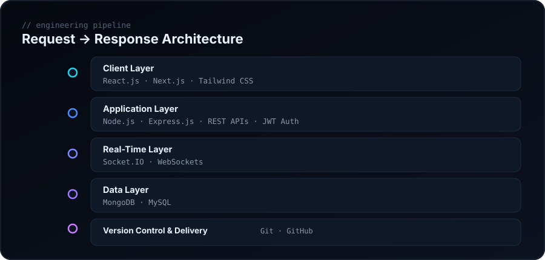

 

<!-- CONFIRM: two different LinkedIn URLs are currently live on your GitHub account — pick the correct one before publishing (see NOTES.md) -->

<!-- CONFIRM: is https://socialweb-cnfj.onrender.com your portfolio, or a project deployment? Uncomment and fix the label once confirmed.

-->

 

## `01` System Status

<table>
<tr>
<td width="25%" align="center">🟢 <b>Building</b> MERN + Next.js</td>
<td width="25%" align="center">⚡ <b>Full Stack</b> Frontend → Backend → DB</td>
<td width="25%" align="center">🧠 <b>Learning</b> TypeScript · Cloud</td>
<td width="25%" align="center">🚀 <b>Open To</b> Collaboration</td>
</tr>
</table>

 

## `02` About

I build full-stack web applications on the MERN stack — React/Next.js on the front end, Node.js and Express on the back end, backed by MongoDB or MySQL depending on the shape of the data. I'm particularly drawn to **real-time systems** (Socket.IO, WebSockets), clean **REST API design**, and **JWT-based authentication** — the parts of an app that fail quietly if you get them wrong.

Right now I'm deepening my TypeScript and Next.js practice, studying backend architecture patterns beyond CRUD, setting up CI/CD with GitHub Actions, and getting comfortable deploying to AWS, Vercel, and Firebase.

I learn fastest by rebuilding things that already work — I've cloned parts of LinkedIn, Instagram, and YouTube specifically to understand the engineering decisions behind them, not just to ship a demo.

 

## `03` Tech Stack

<table>
<tr>
<td valign="top" width="33%">

**Frontend**
 

</td>
<td valign="top" width="33%">

**Backend**
 

</td>
<td valign="top" width="33%">

**Data · Real-Time · Tools**
 

</td>
</tr>
</table>

 

## `04` Engineering Pipeline

 

## `05` Featured Projects

<table>
<tr>
<td width="100%">

**Tic-Tac-Toe-Game**
 
Browser-based two-player game built to practice DOM manipulation, game-state logic, and win/draw detection in vanilla JavaScript.
  
`JavaScript` `HTML` `CSS`
  
🔗 [Repository](https://github.com/Pushpankarmishra7084/Tic-Tac-Toe-Game)

</td>
</tr>
</table>

<!--
  CONFIRM: your account currently shows 7 repositories. Beyond Tic-Tac-Toe-Game, the others
  (netgame, hello, test, free-api.github.io) are either forks or don't have enough description
  to feature credibly to a recruiter. Rather than invent project copy, add real cards here for
  your strongest 2-3 projects using this template:

  **Project Name**
  One-line description of the problem it solves.
  `Tech` `Tech` `Tech`
  🔗 [Live Demo](#) · [Repository](#)
-->

 

## `06` Currently Building

- Strengthening **TypeScript** across new and existing projects
- Going deeper into **Next.js** (App Router, server components)
- Backend architecture beyond basic CRUD
- **CI/CD** pipelines with GitHub Actions
- Deployment on **AWS**, **Vercel**, and **Firebase**

 

## `07` Architecture Mindset

When I build, I optimize for:

`Scalable APIs` `Authentication & authorization` `Real-time data flow` `Sensible database design` `Clean, maintainable UI` `Deployment & CI/CD` `Long-term maintainability`

 

## `08` Contributions

<!-- Live, dynamically-computed GitHub stats — not static numbers -->

  

<!-- Auto-generated daily via .github/workflows/profile-3d-contrib.yml — see NOTES.md for setup -->

 

## `09` Connect

**Let's build something useful.**

<a href="https://github.com/Pushpankarmishra7084">GitHub</a> ·
<a href="https://www.linkedin.com/in/pushpankarmishra/">LinkedIn</a> ·
<a href="mailto:pushpankarmishra7084@gmail.com">Email</a>

  

&lt; BUILD → SHIP → LEARN → REPEAT /&gt;

